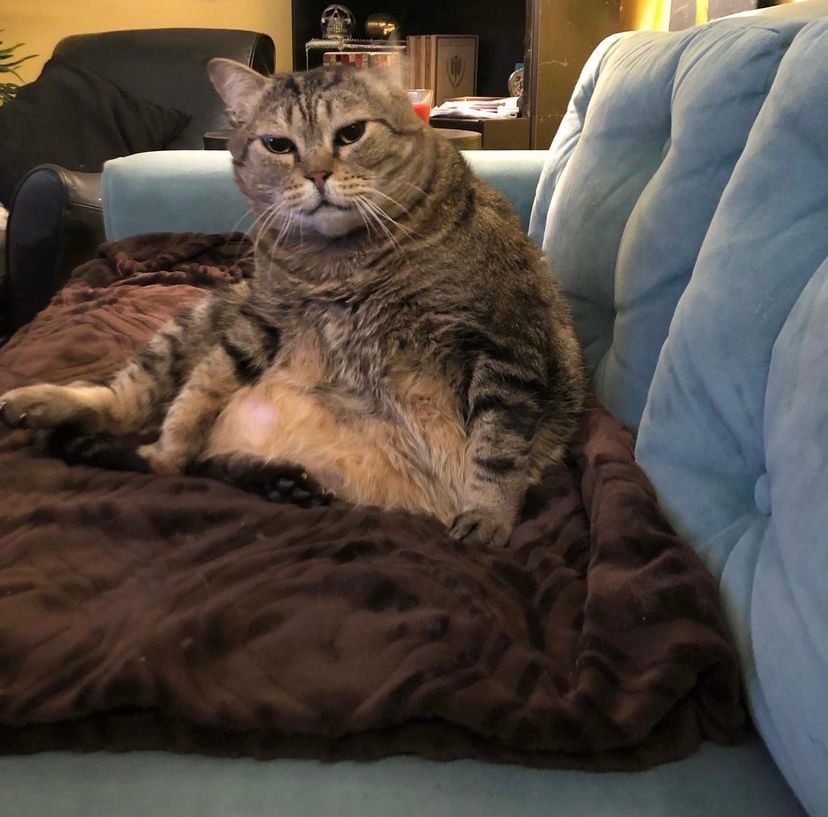

# First instruction set

<figure markdown>
{ width="200" }
 <figcaption>Width 200</figcaption>
</figure>

<figure markdown>
{ width="300" }
 <figcaption>Width 300</figcaption>
</figure>

<figure markdown>
{ width="400" }
 <figcaption>Width 400</figcaption>
</figure>

<figure markdown>

 <figcaption>Original Size</figcaption>
 </figure>

<figure markdown>
{ width+"350"}
<figcaption>Maurice</figcaption>
 </figure>